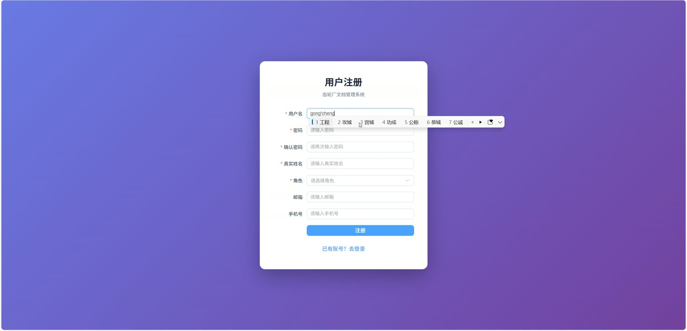
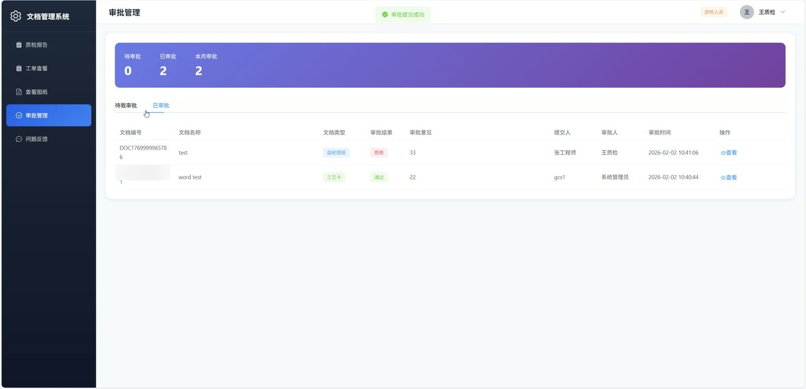
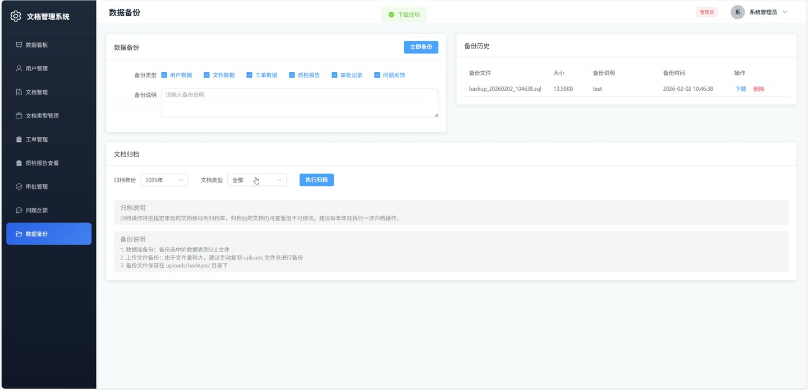
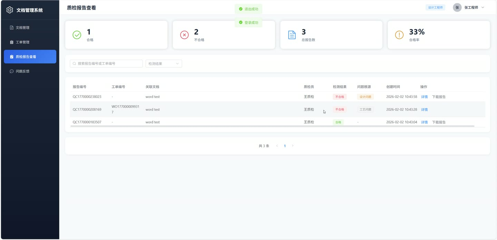
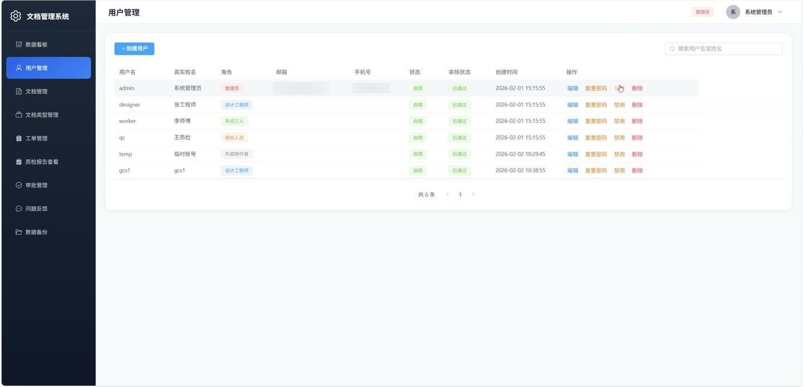
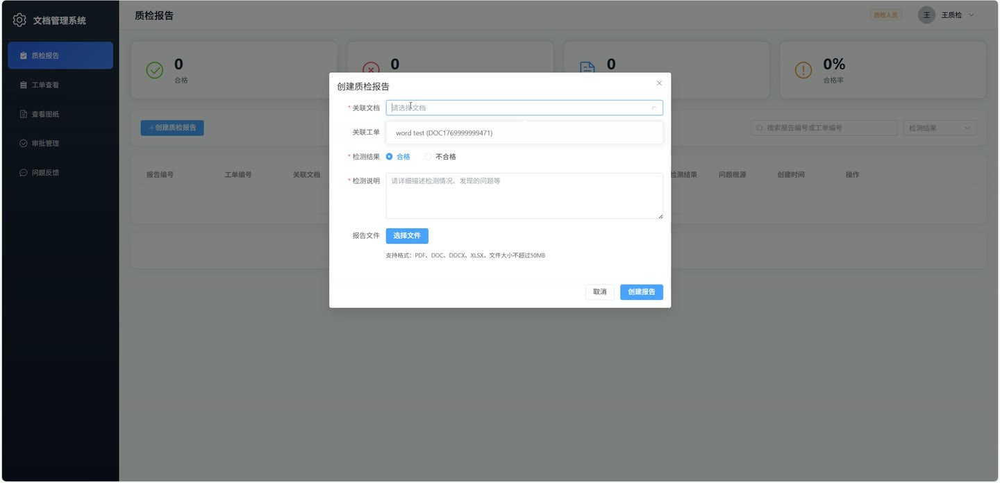

# (附文档)Springboot3+Vue3+MySQL 齿轮厂文档管理系统

**技术栈**：Springboot3、Vue3、MySQL

### 系统简介

齿轮厂文档管理系统是一套面向齿轮制造企业的文档与质量协同管理平台，采用 Spring Boot 3 + Vue 3 前后端分离架构。系统覆盖文档上传审批、工单流转、质检报告、反馈闭环、数据备份及看板统计等核心业务，支持管理员、设计工程师、车间工人、质检人员、外部协作者五种角色协同工作。
 
### 核心功能
 
### 普通用户端

 
- 用户注册：填写用户名、密码、角色（不可注册管理员），提交后自动进入待审核状态 
- 用户登录：输入用户名和明文密码，系统校验账号状态与审核状态后返回 token 
- 查看个人信息：通过 Authorization 请求头获取当前登录用户的详细信息 
- 修改个人信息：更新真实姓名、联系方式等字段，不可修改用户名、角色、状态 
- 修改密码：提交原密码和新密码，系统校验原密码正确性后更新密码 
- 查看个人仪表盘：根据角色展示总文档数、总工单数、待处理项、通过率/完成率等统计
 
### 管理员端

 
- 用户管理：分页查询用户列表（支持关键字搜索），创建新用户，编辑用户信息，启用/禁用账号 
- 用户审核：查看待审核用户列表，通过或拒绝注册申请，填写审核备注 
- 重置用户密码：将指定用户的密码重置为默认值 password123 
- 文档类型管理：分页查询文档类型列表（支持关键字搜索），新增/编辑/删除文档类型，校验类型代码唯一性 
- 文档管理：分页查询所有文档（支持按关键字/文档类型/状态筛选），查看文档详情，更新文档名称/类型/齿轮型号/齿轮参数 
- 删除文档：检查文档关联的工单/质检报告/审批/反馈数量，无关联时删除文件及版本记录 
- 审批管理：查看所有待审批和已审批列表（关联文档编号、名称、提交人、审批人），执行审批通过/拒绝并填写意见，同步更新文档状态 
- 删除审批记录：删除指定的审批记录 
- 数据备份：选择要备份的数据表（用户/文档/工单/质检报告/反馈/审批），填写备份说明，执行数据库备份并生成 .sql 文件 
- 备份历史管理：查看备份文件列表（文件名、大小、创建时间、说明），下载备份文件，删除备份文件 
- 文档归档：输入年份和文档类型，将已审批文档状态更新为 ARCHIVED 
- 数据看板：查看总文档数、总工单数、待处理反馈数、质检合格率，文档类型分布图表，月度工单趋势图表 
- 质检报告管理：分页查看所有质检报告（关联质检员姓名和文档名称），查看报告详情，编辑报告结果/问题来源/备注，删除报告并清理附件 
- 工单管理：分页查看所有工单（关联工人姓名和文档名称），创建工单（自动生成工单号），更新工单状态/信息，删除工单 
- 反馈管理：分页查看所有反馈（支持按文档/状态/提交人/反馈类型筛选），回复反馈
 
### 设计工程师端

 
- 文档上传：上传文件并填写文档名称、文档类型、齿轮型号、齿轮参数，自动生成文档编号并设置状态为草稿 
- 创建新版本：上传新文件并填写变更日志，系统自动计算下一版本号（如 V1.0 → V1.1 → V2.0），保存旧版本到版本表 
- 查看版本历史：查看指定文档的所有版本列表（版本号、变更日志、创建人、创建时间） 
- 文档预览：在线查看 PDF/图片格式的文档文件 
- 文档下载：下载文档主文件或指定版本的文件 
- 更新文档信息：修改文档名称、文档类型、齿轮型号、齿轮参数 
- 查看个人仪表盘：统计本人上传文档数、待处理的图纸问题反馈数、文档审批通过率 
- 提交反馈：针对文档提交图纸问题反馈，上传图片附件，设置反馈类型为 DRAWING_ISSUE
 
### 车间工人端

 
- 查看个人工单：分页查看分配给自己的工单列表（关联文档名称和齿轮型号） 
- 更新工单状态：将工单状态从待处理更新为进行中/已完成 
- 按工单号搜索文档：输入工单号查询关联的工单信息和对应文档 
- 查看个人仪表盘：统计本人工单总数、待处理的工艺问题反馈数、工单完成率 
- 提交反馈：针对工单提交工艺问题反馈，上传图片附件，设置反馈类型为 PROCESS_ISSUE 
- 文档预览：在线查看关联文档的 PDF/图片文件 
- 文档下载：下载关联文档文件
 
### 质检人员端

 
- 创建质检报告：选择关联文档，填写工单号、检验结果（PASS/FAIL）、问题来源、备注，上传报告附件 
- 质检报告管理：分页查看所有质检报告（支持按关键字/检验结果筛选），查看报告详情，编辑报告内容，删除报告并清理附件 
- 下载质检报告：下载报告附件文件 
- 审批管理：查看待审批列表（关联文档编号/名称/类型/提交人），执行审批通过/拒绝并填写意见，同步更新文档状态 
- 查看已审批列表：查看自己审批过的记录（含审批意见和审批时间） 
- 查看个人仪表盘：统计质检报告总数、待审批数、待处理反馈数、质检合格率 
- 提交反馈：针对质检问题提交反馈，上传图片附件
 
### 外部协作者端

 
- 文档浏览：查看所有已审批状态的文档列表 
- 文档预览：在线查看已审批文档的 PDF/图片文件 
- 文档下载：下载已审批文档文件 
- 查看个人仪表盘：统计已审批文档总数
 
### 技术栈

  后端框架 Spring Boot 3   ORM MyBatis-Plus   权限 基于角色（ADMIN / DESIGNER / WORKER / QC / EXTERNAL）的请求参数校验   前端框架 Vue 3   状态管理 Vuex / Pinia   构建工具 Vite   数据库 MySQL   文件上传 MultipartFile + 本地文件存储   数据备份 JDBC 直接导出 SQL 
 
### 交付内容

 
- 后端完整源码 
- 前端完整源码 
- 数据库初始化脚本 
- 万字文档

## 界面展示

---

## 获取完整源码 + 万字文档

本仓库为项目介绍页。**完整前后端源码、数据库初始化脚本、万字项目文档**，请访问 [codekk.top](http://codekk.top) 获取。

可作课程设计 / 毕业设计参考，支持远程部署调试。